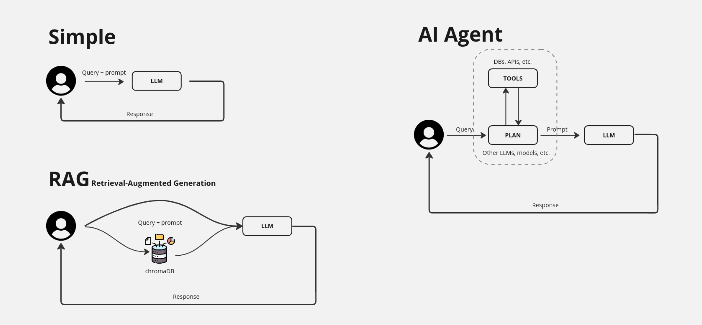

# Descripción del proyecto

Este proyecto busca convertirse en un punto de partida accesible para cualquier persona interesada en el fascinante mundo de los chatbots y los modelos de lenguaje extenso (LLMs de sus siglas en inglés Large Language Model). Nuestro objetivo es proporcionar una base sólida de conocimientos y herramientas prácticas que permitan a usuarios de todos los niveles, desde principiantes hasta desarrolladores experimentados, adentrarse en la creación de sus propios chatbots. Queremos democratizar el acceso a esta tecnología y fomentar la innovación en el campo de la interacción humano-máquina.

De momento tenemos implementados y explicados tres técnicas básicas para crear chatbots y aplicaciones con LLMs: Chatbot básico(main.py), RAG(main_rag.py) y un agente de IA(main_agentia.py):



# Pasos para la puesta en marcha

## Arrancar LLM(Large Language Model)

El primer paso en nuestro proyecto, procedemos a inicializar el modelo de lenguaje LLM(Large Language Model) que servirá como base para nuestro chatbot. En este caso, hemos seleccionado Llama 3.2 3B, un modelo de última generación conocido por su capacidad para generar texto de alta calidad. Para facilitar su implementación y gestión, decidimos ejecutar Llama 3.2 3B a través de un contenedor Docker utilizando la plataforma Cortex. Esta elección nos permite aislar el entorno de ejecución del LLM, garantizando una mayor estabilidad y portabilidad del proyecto y ejecutarlo usando la GPU o CPU.

```
# Arrancamos el contenendor usando la CPU
docker run -it -d --name cortex -p 39281:39281 menloltd/cortex

#  O alternativamente, usando la GPU requiere los drivers 'nvidia-docker' y evidentemente el hardware adecuado
docker run --gpus all -it -d --name cortex -p 39281:39281 menloltd/cortex

# Descargamos el modelo y lo arrancamos 
docker exec -it cortex cortex run llama3.2:3b-gguf-q4-km
```

## Instalación de dependencias Python

Para arrancar el chatbot el primer paso obligatório es instalar las dependencias del python(En nuestro caso vamos a crear también un entorno virtual de Python con el objetivo de tener un único espacio con las dependencias de nuestro proyecto):

```
# Creación y activación del virtual env
virtualenv env
source env/bin/activate

# Instalaciión de dependencias
pip install -r requirements.txt
```

## Puesta en marcha del chatbot básico

Para arrancar el chatbot simplemente arrancar el script 'main.py':

```
# Creación y activación del virtual env
virtualenv env
source env/bin/activate

# Instalaciión de dependencias
pip install -r requirements.txt

# Arranque del script
python main.py
```

## Puesta en marcha del chatbot con RAG

Un RAG (Retrieval Augmented Generation, o Generación Aumentada por Recuperación) es una técnica de inteligencia artificial que combina la capacidad de los LLMs y la habilidad de buscar información específica en una base de datos(Normalmente una base de datos vectorial).

Para arrancar el chatbot con el RAG simplemente arrancar el script 'main_rag.py':

```
# Arranque del script
python main_rag.py
```

### Probar el script para trastear con ChromaDB

Para arrancar el script y trastear con ChromaDB(Base de datos orientada a vectores) ejecutamos el script 'testchromadb.py':

```
# Arranque del script
python testchromadb.py
```

## Puesta en marcha del agente de IA

Un agente de IA es un sistema que percibe su entorno, toma decisiones y realiza acciones con el objetivo de alcanzar metas específicas. Para ello se conecta a distintos tipos de herramientas como bases de datos, APIs, dispositivos, etc.

Para arrancar el chatbot con el Agente de IA simplemente arrancar el script 'main_agentia.py':

```
# Arranque del script
python main_agentia.py
```

# Referencias

- Vídeo de Youtube ["Aprende a desarrollar chatbots desde 0"](https://www.youtube.com/watch?v=Q_NLkUsJJ2c)
- Vídeo de Youtube ["Aprende a desarrollar chatbots con RAG(Retrieval-Augmented Generation) usando ChromaDB"](https://www.youtube.com/watch?v=Etx2WSKQUS0)
- Vídeo de Youtube ["Tutorial de desarrollo de IA Agents"](https://www.youtube.com/watch?v=ACGXJ13cvEQ)
- Artículo ["Cortex: Desplegando LLMs en local"](https://www.albertcoronado.com/2024/12/03/cortex-plataforma-de-ia-para-desplegar-llms-en-local) 


